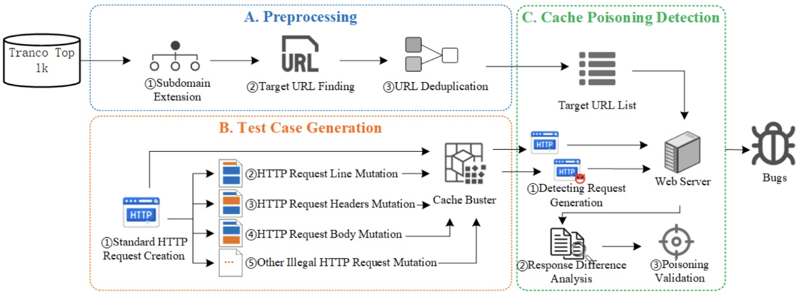

# Hcache
*HCache* is a novel testing methodology to facilitates the widespread identification of WCP vulnerabilities. 


## Prepare
Install Redis, please see [Install Doc](https://redis.io/docs/latest/operate/oss_and_stack/install/install-redis/)
Install RabitMQ, please see [Install Doc](https://www.rabbitmq.com/docs/download)


## Usage
* step 0: pip3 install -r requirements.txt
* step 1: python3 url_seed_init.py top-1m.csv
* step 2: nohup python3 url_extend.py > extend.log & 
* step 3: nohup python3 url_wcp_test.py > result.log &


## How to cite us?
This framework is based on our latest research,"Internet’s Invisible Enemy: Detecting and Measuring Web Cache Poisoning in the Wild", accepted at CCS '24.

If you want to cite us, please use the following (BibTeX) reference:
```
@INPROCEEDINGS {,
    author = {Y. Liang and J. Chen and R. Guo and K. Shen and H. Jiang and M. Hou and Y. Yu and H. Duan},
    booktitle = {CCS ’24},
    title = {Internet’s Invisible Enemy: Detecting and Measuring Web Cache Poisoning in the Wild},
    year = {2024},
    volume = {},
    issn = {979-8-4007-0636-3/24/10},
    keywords = {Network Security, Measurement, Web Cache, Web Cache Poisoning},
    doi = {10.1145/3658644.3690361},
    url = {https://doi.org/10.1145/3658644.3690361},
    publisher = {IEEE Computer Society},
    address = {Salt Lake City, UT, USA},
    month = {october}
}
```


## Disclaimer
Please refrain from using these tools for any unlawful purposes. The author assumes no responsibility for illegal actions. Misusing the provided information may lead to legal consequences.
